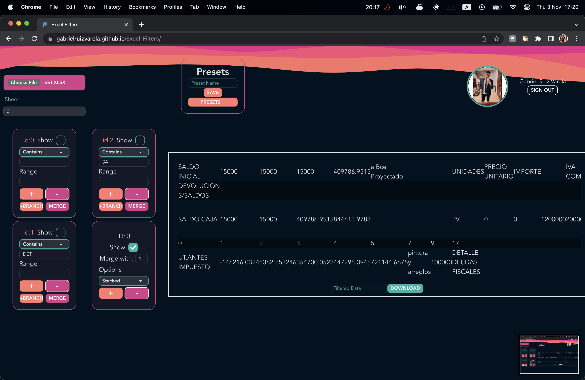

# Excel-Filters

This projects aims to ease the extraction of data of an Excel file. The app let you add filters that acts like nodes in a graph. The filters are applied in the order they are added, you can choose what filter to display, add new branches, merge two branches, and remove filters, and the type of matching to use.

The app provide the use of presets that can be saved in the cloud, using the [Firebase](https://firebase.google.com/) database.

Build with React, Redux, and Firebase.

Preview: https://gabrielruizvarela.github.io/Excel-Filters/
